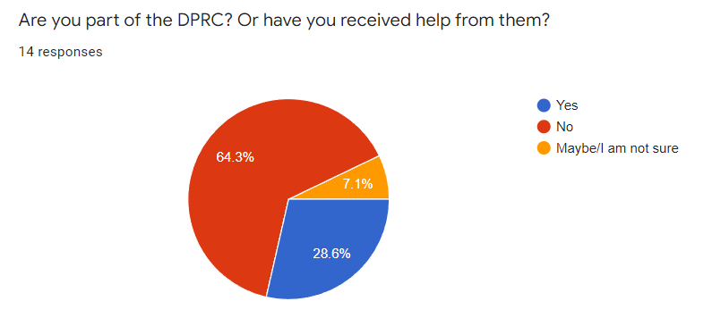
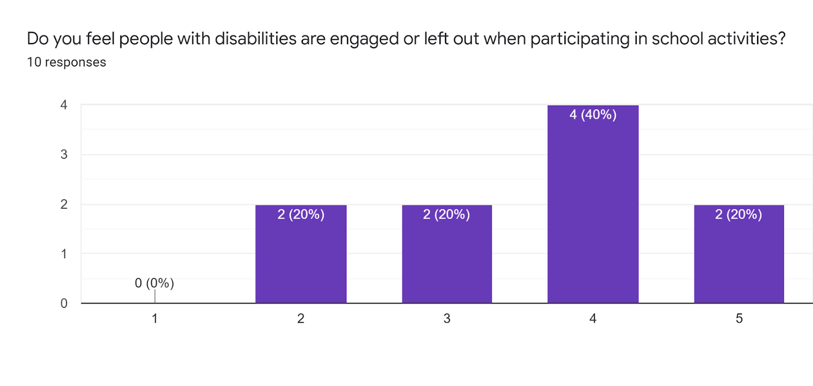
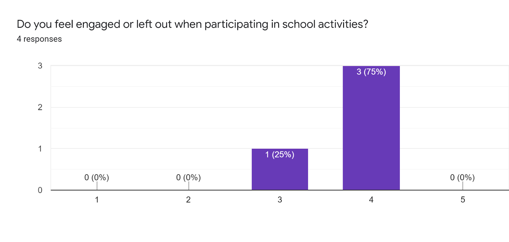
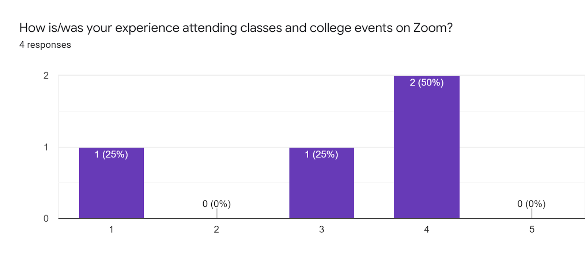
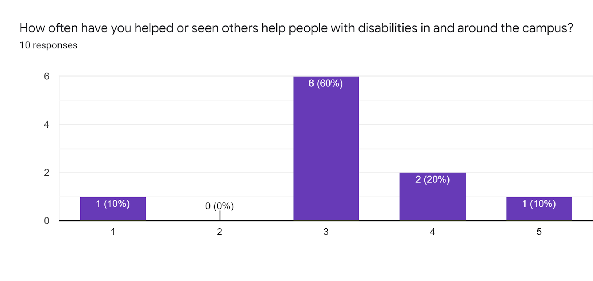

<!-- Main -->

<!-- One -->
<section id="one">
	

		<header class="major">
			<h1>Our User Research</h1>
		</header>

<!-- Content -->

We are interested in creating more empathy and caring towards groups with disabilities at San Francisco State University (SFSU). People with disabilities may feel left out by stereotypes that others think about them. There are definitely barriers for some people between them and society, whether it be because of misinformation, misunderstanding, or lack of empathy. People with disabilities are also a part of the community that we live in, so creating a better place for them will help us all. In this document, we will explain this problem in more depth, we will explain  the approaches that we have taken towards solving this problem, we will go over data collected from our research, and explain how we will use this data in the next steps of our project.

		
<h2 id="content">How did we approach the problem?</h2>

We created a few mockup designs for our website, where we create posts to increase the empathy towards people with disabilities. To gather stories that we want to share, we reached out to users in various ways. We created a qualitative survey that asks general open-response questions like how are you, and also asked them to share their stories that have been meaningful to them. We also asked them for feedback regarding how to increase the empathy on SFSU’s campus. We allowed them to input their email and participate in a follow up if they wanted to. We are a bit unsure of how to address the problem of accessibility for our survey and website, but we recognize the problem.

	

We were looking for target users via various connections. We contacted professors who we knew from current/previous classes to inform them to get responses from targeted users. We also reached out to DPRC(the organization that serves students with disabilities) and we expected the large number of people to respond(which did not happen due to privacy issues). We created a flier and posted it on the library bulletin board. We also published our survey in discord servers that we were joined to get attention from students with disabilities.

		

After gathering data from our participants in the survey, we looked at each of the responses in order to see which areas were in need of more aid. In order to analyze our data, we used a scaling system where our participants were to rate their answers on a scale of 1(strongly disagree)-5(strongly agree) of some of the problems around SFSU. Using those numbers, we then created a box and whisker chart for each of the questions to see which area needed the most change. We then found out that the only negative part that everyone chose was being left out in the SFSU community. We assumed this is caused by COVID-19, where many people took remote classes for 2 years. For our short answer portion, we categorized the data into several themes by using affinity diagrams and saw that a lot of the responses were geared towards how we could make SFSU a better place for everyone especially on educating disabilities information and really cares about how we can understand and provide the suitable help for them. Judging from that, it can be safe to say that the participants in this survey care for those with disabilities.

		
<h2 id="content">Results for Scaling Questions</h2>

 

	

		<h3>Little background of our participants</h3>
		
A total of fourteen people participated in the survey. Few questions have less than eleven responses. There are less participants who are not interested or not willing to share their opinions. Out of all our respondents 28.6% were part of DPRC or have received help from them as shown in the pie chart below (note, our survey asked different questions for respondents who are part of DPRC or received help from them(4), and the ones that are not(10)

	

	

		 
		
	

	

		<h3>Feel being left out</h3>
		
 Some participants express their satisfaction with the services provided by DPRC such as room accommodation and space for exam takers, shown in the graphs below. Some participants also feel they are being left out when they are participating in school activities, but the majority don’t. This means that there are some flaws that can be improved upon at SFSU for the non-DPRC community, and for the DPRC community, SFSU is doing good, but can still improve.

	

	

		 
		
		
	

	

	

		<h3>Online learning experience</h3>
		
For participants who are involved in online learning and part of DPRC or received help from them, most participants are having moderate experience from learning in an online environment, as it is shown in the four responses that we collected, shown below. Also this shows that the zoom experience at SFSU is not the best.

	

	

		 
		
	

	

	

		<h3>Is our campus caring?</h3>
		
Participants also give short suggestions on the improvement of the school community to support students with disabilities. When asked to what extent do you feel our community cares for people with disabilities,  we only received neutral, agree and strongly agree responses.

		
Also, a majority of the non-DPRC respondents selected neutral when asked how often have you helped or seen others help people with disabilities in and around the campus? This indicated that there is room for improvement to support students with disabilities at SFSU.. 

	

	

		 
		
		
	

		
<h2 id="content">Results for Short Answer Questions</h2>

<h3>Education about disabilities</h3>

After doing some analysis for our data, we figured out there’s some overlapping topics between the answers for different questions. First is “Education about disabilities”. From the data collections, participants mentioned that they think it’s more important to be more educated on disability information. When people offer special attention or extra support towards people with disabilities, they might assume that they “need” this help. “Always Ask Before Giving Assistance” (By Illinois Department of Human Services) is one of the important points on their guide. We found out that to solve the problem by raising empathy, it’s not simply about promoting people to care more for people with disabilities by offering physical support. It’s about really understanding what they feel or if they need any help and avoiding any stereotype, and give them a voice.

<h3>On-Campus Activities and resources</h3>

Another overlap is “On-Campus Activities and resources”. The data that touched this topic are mostly focusing on having events or resources that could bring the people with disabilities all together and make connections there. This reminds us of those school clubs for students from different countries or who have similar interests. It’s hard to get involved in school without some connections, especially for freshmen. Participants are suggesting to have some social events or maybe a discord group to help them to connect with others before coming back on-campus. And once we move back to campus, we can have some centering activities not limited to disabilities informational workshops or a conference where they can share their feelings or ideas to others.

<h3>Hit and Misses of DPRC and Professors.</h3>

Although the survey is open to any students/faculty that goes to SFSU, there’s some participants that have received help from DPRC. From that data, we found out that the majority of people have good feedback to DPRC. They provide services and resources to students with disabilities and are willing to offer help to them such as room accommodations. One participant shared that while some friends have shared with him/her about how our community offered unconditional support, others have had bad experiences where professors/classmates don’t care about them.

<h2 id="content">Conclusion</h2>

It’s interesting to see some students (who are not from DPRC) have strong opinions about how to improve the community. They wish the community to be well-educated and they do care about how the people with disabilities feel. It’s expected to see that the majority of students agree that online learning can be difficult for them and if we have some resources to help them make connections before coming back to college, it would be easier to get involved in school.

This finding informs us on relevant topics that surround experiences of people with disabilities on campus, and gives us information on what the SFSU community offers, and also what it lacks surrounding students with disabilities. All of our findings inform what we can design in the way that it provides information that we can showcase in our platform, and also gives us candidates that are willing to share their stories in our platform. The different information that we collected informs us that there are different themes, therefore we can design a system that has different sections for the different themes, and group our stories accordingly. As we collect new information/data/stories, our team would have to do a re-evaluation of the system, and update the themes as they change over time. We will have different sections within our platform that contain stories and information regarding each of the main themes that we found: Education and disabilities, On-campus activities and resources, and the hits and misses provided by the DPRC.

The direction that we will move forward in designing is beginning the implementation of the UI of our platform by creating sketches and storyboards, and we will look for locations to showcase our platform. Our platform will be very simple to use, because it will contain only a few frames, which will be reused for different data points, which will help the user navigate our app. This structure will also make the user remember where everything is located. A structure of our platform will be provided in the following sketches.
	

</section>
	
<section id="two">
            

                
Check out our affinity diagram, where all the anonymised respondes are!

                <ul class="actions">
                    <li><a href="https://edwin172734.invisionapp.com/freehand/CSC-842-Affinity-Diagram-Ialzwh5mB?dsid_h=774b48d6d1c3d2238e4258a05a72e5e4ca0edb95ed5b4c620f2711176f8d36b0&uid_h=c00f7d05f3ca9d02c0504ea704a92fac60b53f3d2e43d0183831eacbe9a88fef" class="button next"  target="_blank">Affinity Diagram</a></li>
                </ul>
            

</section>

