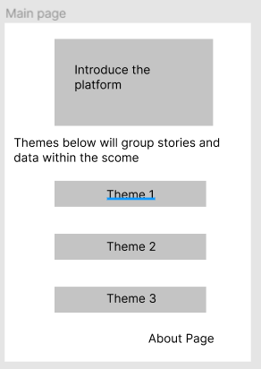
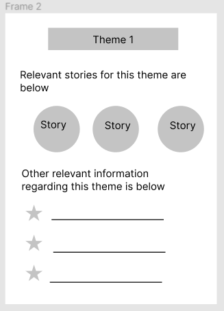
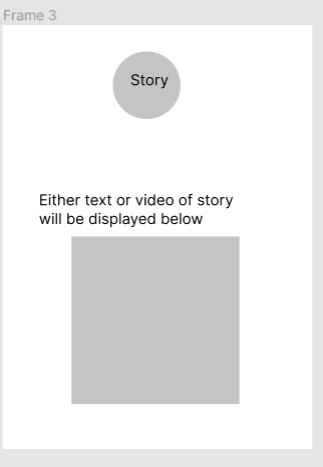
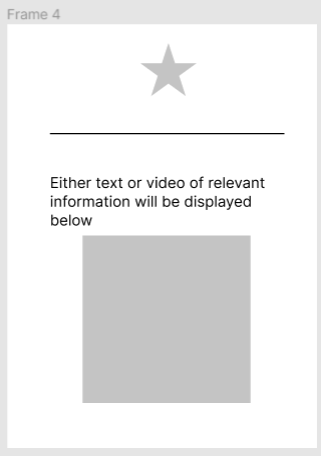
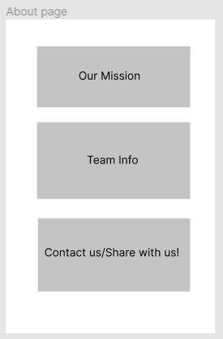

<!-- Main -->

<!-- One -->
<section id="one">
	

		<header class="major">
			<h1>Our Wireframes</h1>
		</header>

<!-- Content -->
		

	

		<h3>Main page</h3>
		
We know the design idea for the main page will work, because it will be user friendly and easy to use. It will contain an introduction to our platform which will explain to the user how to navigate within our platform, and everything will be very basic, in the sense that the users will have only one place to make their selection, and this place will contain themes that are relevant to our audience. The about page is there for general information. As we collect new information/data/stories, our team would have to do a re-evaluation of the system, and update the themes as they change over time. Navigation elements will be on the top to ensure that users can move around.

	

	

		
	

	
		
 

	

		<h3>Theme page</h3>
		
This is a good design, because it contains stories that come directly from the affected audience, and it provides additional information regarding the theme that the user has chosen to review. This is also very easy to use in the sense that the user only has two different locations from where to make their selection, either choose a story to view, or choose other relevant information. Navigation elements will be on the top to ensure that users can move around.

	

	

		
	

	
	
	
 

	

		<h3>Story page</h3>
		
This screen is a good design, because it only shows the story that the user wants to review, therefore making a direct line of communication between the user of our platform, and the individual sharing their story. This design contains only a title/image, and the story. This will help in making the user engaged. Navigation elements will be on the top to ensure that users can move around.

	

	

		
	

	
		
	
 

	

		<h3>Relevant information page</h3>
		
This screen is a good design, because it only shows the relevant information that the user wants to review, therefore creating a direct connection between the user of our platform and the source of our data . This design contains only a title/image, and the relevant data. This will help in making the user engaged.Navigation elements will be on the top to ensure that users can move around.

	

	

		<h3>Picture</h3>
		
	

	
	
 

	

		<h3>About page</h3>
		
This is a good design because it presents the user options that represent who we are as a team, and also what we intend to do, which is good, because the users can inform themselves about what they will experience in our app. This design is also good, because we can generate more stories based on people that communicate with us, and also improve our app based on feedback. Navigation elements will be on the top to ensure that users can move around.

	

	

		
	

		
<h2 id="content">Clarification & Conclusion</h2>

Some of the limitations that we have encountered are that this application is non-profit only, therefore we do not collect money from users. It is also difficult to verify the legitimacy of each story that is shared by each user. Besides, this application is not quite friendly for some users in some serious conditions.

The idea for this project focuses on increasing the empathy within our SFSU community. Since our analysis method is conducted by qualitative open-response survey. There is a really high chance that participants will ignore it. As a result we only have a few participants who completed the survey. Interestingly not everyone answers all questions from the survey, there is the indication that participants may miss or not be interested to answer those questions. Overall, with our implementation of the box and whisker chart, we were able to deduce where SFSU had the most flaws and where SFSU was doing good on. Not only that, but we were also able to see some responses on how SFSU can be more inclusive and a place for everyone. From the data that we collected, it seems like our potential users are also wanting to create a friendly environment for people with disabilities. By looking at our user research, we categorized the data into three main themes - Education about disabilities, On-Campus Activities and resources, and Hit and Misses of DPRC and Professors, and we are going to create subpages for these themes. By sharing the inspiring stories and some educated information on our platform, we hope to improve our community by bringing the care and support (both physical and mental) to students with disabilities. Our research provided very helpful information regarding important themes within the students with disabilities community at SFSU, which helped us design which themes we want to include in our application. By designing our platform the way we did, we will make it simple for users to navigate and also make them engaged, at the same time that we try to improve some aspects surrounding students with disabilities at SFSU by making the audience more empathetic towards them, and also making them care for them.

</section>

