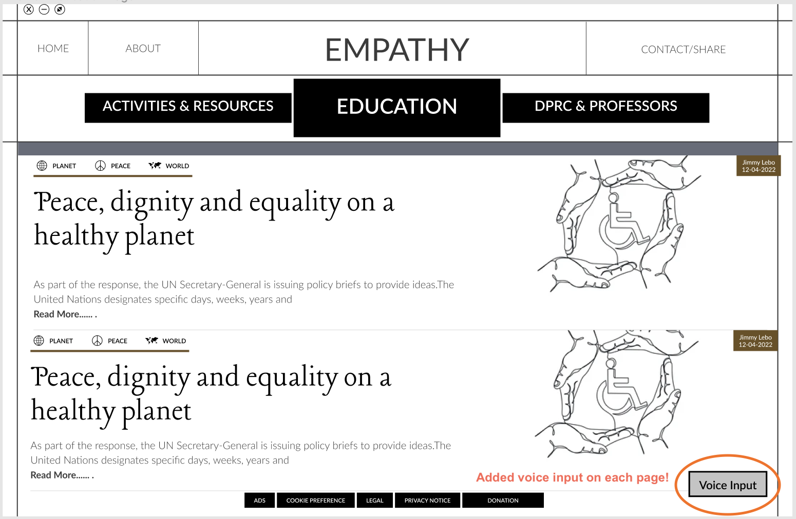
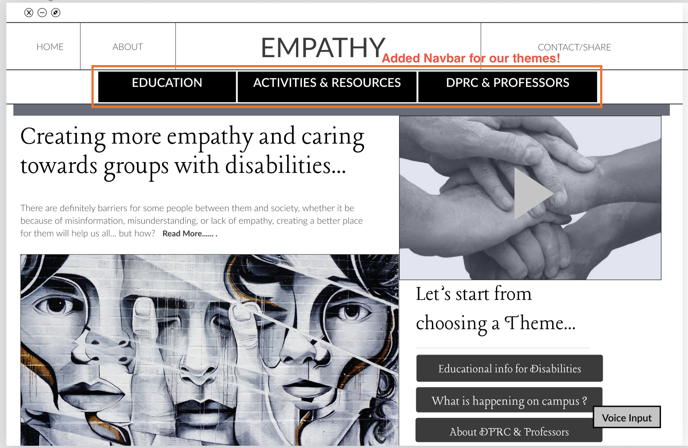
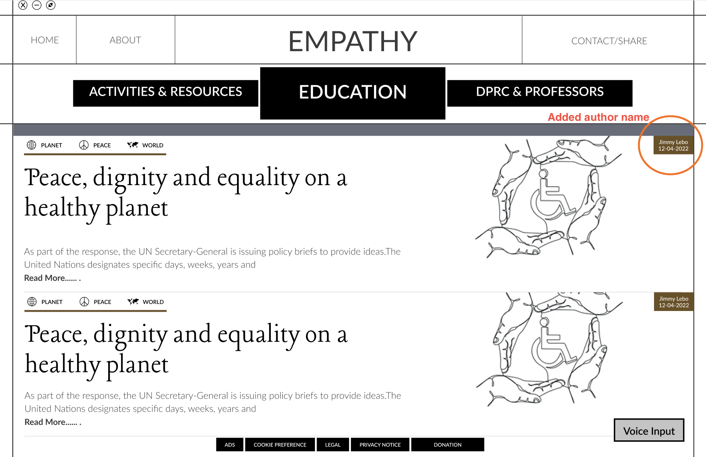
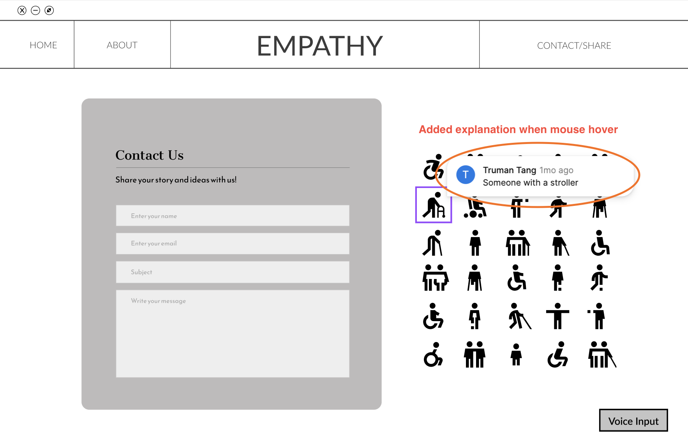
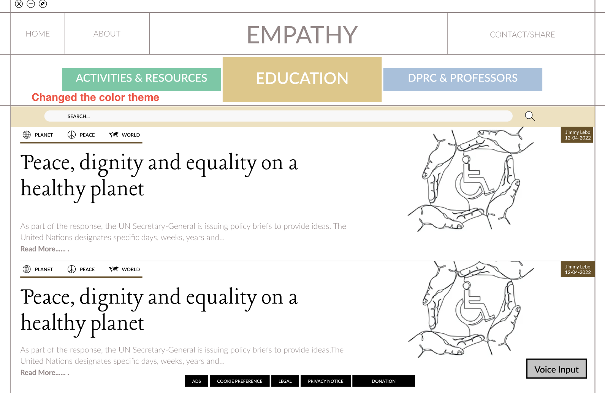

<!-- Main -->

<!-- One -->
<section id="one">
	

		<header class="major">
			<h1>Iterating Through Our Prototype</h1>
		</header>

<!-- Content -->	

	

		<h2 id="content">Add Voice Input</h2>
		
One of the iterations we made was adding voice input in order to make our application user friendly. It is important that our application is user friendly because its needs to include everyone in our site and leave no man left behind. This will specifically target users such as blindness or have a hard time moving their bodys. You can suggest whether to move on to another page or list the name of the post you want to hear.

	

	

		 
		
	

		

	

		<h2 id="content">Navbar</h2>
		
Another iteration that was made was the navbar for our themes. Originally we had it only on the homepage, but that can make it frustrating and not user friendly for users to go back to the homepage every time they want to change the theme. As a result we created another navbar that can switch easily between the theme during any part of the website.

	

	

		 
		
	

		

	

		<h2 id="content">Showing Author Name</h2>
		
Something else that was iterated was adding the author name to each of the posts to allow users to recognize those who have earned themselves a name. With the original anonymous supplier of information it would be hard to tell whether some posts are accurate or fake. As a result, those who can establish credibility will be easily trusted by the users.

	

	

		 
		
	

		

	

		<h2 id="content">Hover Icons</h2>
		
Another important iteration that was made was our option to hover icons and display which disability it represents. Despite our  team learning more about those with disabilities, not even we can identify which icons mean which disability. As a result, we found it important and informative for our users to be able to know which icon means which disability when they hover them.

	

	

		 
		
	

		

	

		<h2 id="content">Search Bar</h2>
		
The last iterations that were implemented was the color design and the search bar. We found that our original black and white to be very gloomy as our color choices. By using brighter colors it will create a more welcoming environment for users to be in. Brighter colors also prove to be more inviting. A search bar is very much needed as posts can get lost or harder to find as time goes on. With the search bar feature, users will be able to find exactly what they need or are interested in. These new key features definitely boosted our prototype.

	

	

		 
		
	

		

</section>

